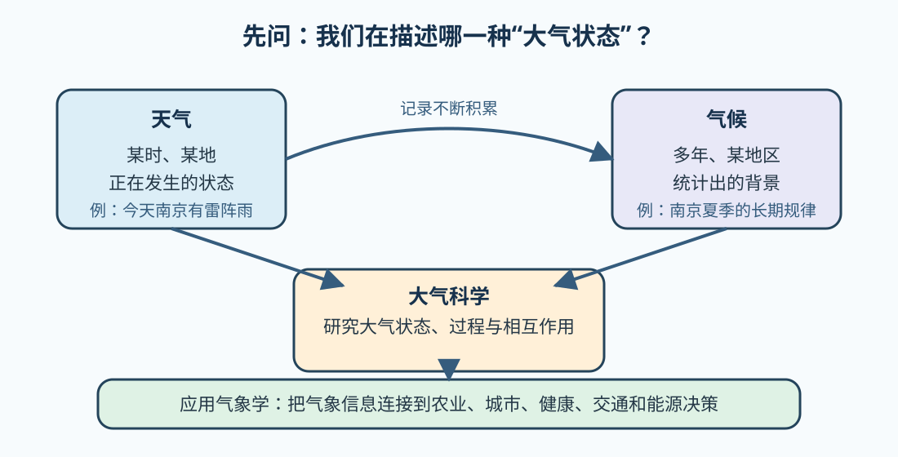

# 01 天气、气候与大气科学：先分清研究对象

> 同一句“今天很热”，如果没有时间、地点和比较标准，信息其实还不完整。

## 先回答一个问题

“今天南京闷热，下午可能有雷阵雨”描述的是天气；“南京夏季通常高温高湿，降水有明显季节规律”描述的是气候；“雷阵雨会不会影响今天的户外观测”则已经进入应用气象学。

它们都和大气有关，但问题的时间尺度、空间范围和使用目的不同。先把对象分清，后面的气象要素、观测资料和天气系统才不会混在一起。

## 一张关系图



## 三个核心概念

### 天气：现在或近期的大气状态

天气关注某个地点或区域在较短时间内的状态和变化，例如温度、气压、湿度、风、云、能见度和降水。说“今天很热”时，至少还要追问：在哪里？什么时段？用什么温度或体感标准比较？

### 气候：长期统计出来的背景

气候不是“很久以前的天气”，而是一个地区在较长时间内的平均状态、变化范围、季节规律和极端事件特征。一次高温天气是一个天气样本，不能单独代表气候；但很多天气记录积累起来，才能帮助我们认识气候。

可以把它记成一句话：

```text
天气：今天、这里发生了什么？
气候：这里长期通常怎样，可能偏离多少？
```

### 大气科学与应用气象学：从认识到使用

大气科学研究大气及其与海洋、陆面和生物圈之间的相互作用。气象学集中研究大气现象、过程、观测、分析和预报；应用气象学进一步追问：这些知识如何服务农业、城市、生态、健康、交通和能源等实际问题？

## 看一个小例子

假设你在南京连续三天、每天 14:00 记录温度和天空状况：

| 日期 | 温度 | 天空状况 | 是否有降水 |
| --- | ---: | --- | --- |
| 第一天 | 32 °C | 多云 | 无 |
| 第二天 | 34 °C | 晴 | 无 |
| 第三天 | 29 °C | 雷阵雨 | 有 |

这张表可以描述三天的天气。它不能直接回答“南京夏季是否变得更热”，因为那个问题需要更长时间、更稳定的观测地点和明确的统计方法。若要判断第三天是否异常，还需要与多年同期资料比较。

## 回忆练习

先不要看答案，试着用自己的话回答：

1. “今天南京有雷阵雨”为什么是天气问题？
2. 三天记录为什么不能单独代表南京的气候？
3. “雷阵雨是否影响户外观测”为什么属于应用气象问题？

<details>
<summary>展开参考答案</summary>

1. 它指向一个具体地点和较短时间内的大气状态。
2. 三天的样本太短，不能描述长期平均、变化范围、季节规律或极端事件特征。
3. 它不只描述天气，还把气象信息用于一项具体活动和决策。

</details>

## 最容易混淆的地方

- “气候就是天气的平均值”不够完整，气候还包括变率、范围、季节性和极端事件等统计特征；
- “今天很冷，所以全球变暖不成立”把单日天气和长期气候趋势混成了两个尺度；
- “天气预报给了结果，所以不需要理解气象学”忽略了观测、机制和不确定性。

## 小结

天气回答“现在、这里的大气怎么样”；气候回答“一个地方长期通常怎样、变化范围多大”；大气科学研究这些状态和过程；应用气象学把认识转化为实际决策支持。

下一课将从“空气由什么组成、为什么高度会改变大气状态”开始，进入大气组成与垂直结构。

## 继续阅读

- [NOAA NCEI：What’s the Difference Between Weather and Climate?](https://www.ncei.noaa.gov/news/weather-vs-climate)
- [NOAA Ocean Service：What is the difference between weather and climate?](https://oceanservice.noaa.gov/facts/weather_climate.html)
- [课程资源与教学方法调研](../RESOURCES.md)
