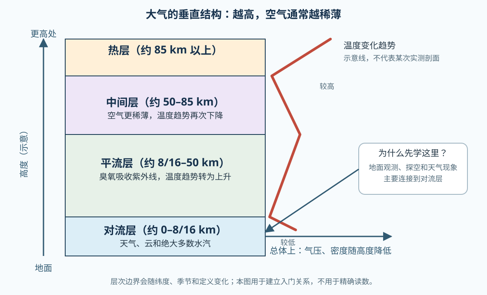

# 02 大气组成与垂直结构：空气不只是“透明的空”

> 天气主要发生在离地面不远的地方，但理解它需要先知道空气由什么组成、向上会怎样变化。

## 学习目标

读完本单元后，你应该能够：

- 区分干空气的主要成分、水汽和气溶胶；
- 解释为什么气压和空气密度通常随高度升高而降低；
- 说出对流层和平流层的入门特征，并知道温度不会在所有高度都按同一方向变化；
- 根据一张垂直结构示意图，判断天气现象更可能出现在哪一层。

## 从一个气象气球开始

气象气球上升时，携带的气象仪器会测量温度、气压、湿度和风。气球越往上通常越膨胀，因为外界气压变小了；这不是“上面没有空气”，而是单位体积内的空气分子变少、空气变稀薄。[UCAR 对气象气球的介绍](https://scied.ucar.edu/learning-zone/atmosphere/weather-balloons)展示了这种观测如何帮助我们认识大气的垂直结构。

## 一、空气由什么组成

### 先看干空气的近似组成

为了便于比较，气象学和大气科学常把水汽暂时排除，先讨论“干空气”。按体积或摩尔分数近似，干空气主要是：

| 成分 | 近似比例 | 初步理解 |
| --- | ---: | --- |
| 氮气 N₂ | 78% | 含量最多，但在许多天气变化中不是最活跃的成分 |
| 氧气 O₂ | 21% | 与呼吸、燃烧和许多化学过程有关 |
| 氩气 Ar | 约 0.9% | 含量不大，化学性质相对稳定 |
| 二氧化碳等微量气体 | 小于 1% 的一部分 | 含量小，但可能影响辐射、化学和气候过程 |

这些数字是背景近似，不意味着每个地点、每个高度、每个时刻都完全一样。可以参考 [NOAA JetStream 的大气成分表](https://prod-01-alb-www-noaa.woc.noaa.gov/jetstream/atmosphere) 和 [UCAR 对空气成分的说明](https://scied.ucar.edu/learning-zone/air-quality/whats-in-the-air)。

### 水汽为什么要单独拿出来

水汽是空气中的气态水。它的含量随地点、温度、季节和天气变化，湿润的近地面空气可以含有明显更多的水汽，干燥的高空则少得多。云和降水正是水汽在大气中发生相变、输送和聚集后的结果。

所以要区分两句话：

```text
干空气组成：用来说明主要气体的背景比例
实际湿空气：还要加上会变化的水汽，以及气溶胶等粒子
```

气溶胶是悬浮在空气中的微小固体或液体粒子，例如尘埃、海盐、烟尘和火山灰。它们虽然数量和质量通常比主要气体小，却可以参与云滴形成、散射或吸收辐射，并影响能见度和空气质量。

## 二、向上走，空气怎样变化

大气有质量，并受到地球引力约束。靠近地面时，上方有更多空气压在下面，所以气压通常更高；向上走，上方空气柱变短，气压和空气密度总体降低。这里的“总体”很重要：局地天气会造成波动，但垂直方向的基本背景仍是越高越稀薄。



## 三、为什么要分层

入门阶段最有用的分层依据是“温度随高度的变化趋势”。按这个标准，从下往上可以先认识四个层次：

- **对流层**：从地面到约 8—16 km，厚度随纬度和季节变化。人类日常天气、绝大多数云和水汽集中在这里；通常越往上温度越低。
- **平流层**：大约从对流层顶到 50 km。臭氧吸收太阳紫外辐射，使这一层的温度趋势与对流层相反，向上升高；这也让它比对流层更稳定。
- **中间层**：大约 50—85 km，空气更稀薄，温度趋势再次转为向上降低。
- **热层**：约 85 km 以上，受到高能太阳辐射影响，空气极其稀薄。它属于大气的一部分，但已经不是我们日常天气的主要活动空间。

这些高度是入门范围，不是硬边界。不同教材可能采用略有差异的数字；[UCAR 的大气分层资料](https://scied.ucar.edu/learning-zone/atmosphere/layers-earths-atmosphere)和[高度变化资料](https://scied.ucar.edu/learning-zone/atmosphere/change-atmosphere-altitude)都提醒读者关注层次特征和温度趋势，而不是死记一条精确高度线。

## 一个读图练习

观察本课的示意图，尝试回答：

1. 为什么图中把天气和云放在对流层？
2. 为什么气压、密度的箭头指向“总体降低”，而温度趋势线会拐弯？
3. 如果气象气球继续上升，为什么它会膨胀，而不是因为外界空气越来越“厚”？

参考答案和进一步解释见[配套练习：读懂大气垂直结构](../../../exercises/01-气象学基础/01.01-读懂大气垂直结构/)。

## 常见混淆

### “空气中氧气有 21%，上山后还是 21%，所以呼吸没有变化”对吗？

不完整。相对比例可以近似保持，但总气压和空气密度会降低，单位体积中可供吸入的分子数也会减少。先记住“比例”和“总量/分压”是不同问题，分压会在后续大气热力学中展开。

### “温度一定越高越低”对吗？

不对。对流层中通常随高度降低，平流层中却因为臭氧吸收紫外辐射而出现相反趋势。正是这种温度趋势差异，帮助我们定义了不同的大气层。

### “平流层没有天气”对吗？

对日常天气来说，可以先把主要注意力放在对流层；但“没有任何过程”过于绝对。平流层仍有辐射、化学和动力过程，后续课程会按需要补充。

## 小结

空气是气体、水汽和悬浮粒子的混合物。干空气主要由氮气和氧气构成，但少量可变成分同样重要。受重力影响，气压和空气密度总体随高度降低；按温度趋势，大气可分为多个层次。对日常天气学习来说，对流层是最重要的起点。

下一课将把“闷热、起风、下雨”这些感觉转换成可观测、可记录的气象要素。

## 继续阅读

- [NOAA JetStream：The Atmosphere](https://prod-01-alb-www-noaa.woc.noaa.gov/jetstream/atmosphere)
- [UCAR：Layers of Earth’s Atmosphere](https://scied.ucar.edu/learning-zone/atmosphere/layers-earths-atmosphere)
- [WMO：Guidelines for the Education and Training of Personnel in Meteorology](https://etrp.wmo.int/pluginfile.php/17117/mod_resource/content/1/WMO%20N%C2%B0258%20-%204th%20Edition.pdf)
