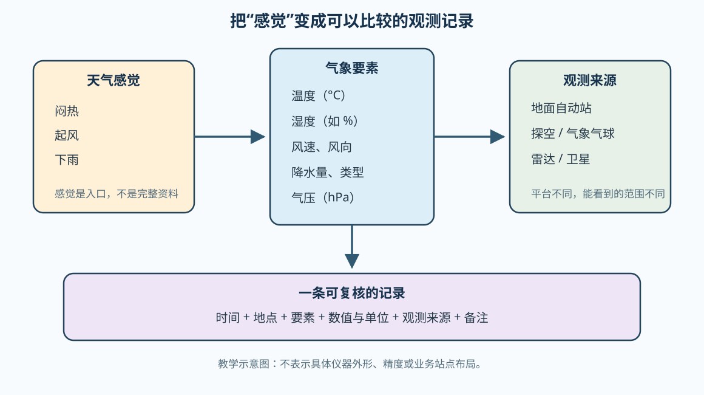

# 03 气象要素与观测：把“闷热、起风、下雨”写下来

> 气象学不是把感觉换成更复杂的词，而是把感觉变成带时间、地点、单位和来源的可比较记录。

## 先从一句话开始

“今天南京很闷，下午还起了风。”这句话有价值，但还不能直接拿来比较两天的天气。我们还需要知道：什么时候、在哪里、温度多少、湿度如何、风多大、是否下雨，以及这些信息来自什么观测。

本课的主要任务只有一个：学会把一段天气描述拆成气象要素，并写成一条基本观测记录。

## 学习目标

读完本单元后，你应该能够：

- 说出温度、气压、湿度、风和降水分别描述什么；
- 区分气象要素、天气现象和观测平台；
- 写出包含时间、地点、单位和来源的观测记录；
- 解释为什么地面站、探空、雷达和卫星不能互相完全替代。

## 一、气象要素是什么

气象要素是用来描述大气状态或变化的可观测量。可以先用下面这张表建立共同语言：

| 日常表达 | 对应要素 | 先记录什么 |
| --- | --- | --- |
| 冷、热、闷热 | 温度、湿度 | 温度数值和湿度指标，分别写单位 |
| 气压高、气压低 | 气压 | 数值、单位和观测时刻 |
| 起风、风变大 | 风速、风向、阵风 | 风速单位、风向或方位、是否为阵风 |
| 下雨、下雪、雨很大 | 降水 | 有无、类型、累计量和时间段 |
| 天空阴、能见度差 | 云量、天气现象、能见度 | 观测等级、现象类别和观测方法 |

这里有一个容易忽略的区别：**天气现象**是我们看到或感受到的事件，例如雷雨、雾和降雪；**气象要素**是帮助我们描述状态的量，例如温度、气压、风和降水量。二者会互相联系，但不是同一个词。

### “湿度”先不要只背一个百分比

空气中的水汽含量会变化，“湿度”在不同语境下可能指水汽含量、相对湿度、露点等不同量。本课只做入门记录：如果来源给出相对湿度，就明确写成“相对湿度 68%”，不要把它直接改写成“空气里有 68% 的水”。相对湿度的定义和露点关系将在后面的水汽单元中展开。

## 二、一条记录至少要有六个字段

为了让别人能够复核，建议把观测记录写成：

```text
时间 + 地点 + 要素 + 数值与单位 + 观测来源 + 备注
```

例如，下面是一条**练习数据**，不是南京某个真实站点的业务记录：

```text
2026-08-22 14:00；某校园气象点；气温 31.2 °C；相对湿度 66%；
风向东南偏东，平均风速 2.8 m/s；降水 0 mm；来源：练习用自动站记录。
```

有了时间和地点，这条记录才能和另一个时刻或另一个地点比较；有了单位，`31.2` 才不只是一个没有意义的数字；有了来源，读者才能判断它是仪器读数、人工目测、预报结果，还是练习中的假设数据。

## 三、不同观测平台看见的东西不同



- **地面观测站**：在近地面固定位置持续记录温度、湿度、气压、风和降水等要素，适合回答“这个点附近现在怎样”；
- **探空和气象气球**：携带仪器上升，得到温度、湿度、气压和风随高度的变化，适合回答“从地面向上，大气结构怎样”；
- **天气雷达**：通过电磁波探测降水粒子等目标，适合分析降水回波、范围和移动，不是直接测量地面温度的仪器；
- **卫星**：从高处观测云、辐射和地表/大气的某些特征，覆盖范围大，但不同产品的变量、分辨率和反演方法不同；
- **预报和再分析资料**：它们是模型计算或观测与模型结合的结果，不能不加说明地当作某个站点的直接观测。

UCAR 将地面观测、原位观测、卫星和模式放在同一个大气研究体系中，但它们的空间范围、时间分辨率和测量对象并不相同。[WMO 的观测指南](https://community.wmo.int/site/knowledge-hub/programmes-and-initiatives/instruments-and-methods-of-observation-programme-imop/guide-instruments-and-methods-of-observation-wmo-no-8)则把温度、气压、湿度、地面风、降水和观测系统分别列为规范化测量主题。

## 四、三天小记录

如果你没有专业仪器，可以先做一个学习版记录：固定地点、固定时间，记录手机或公开站点能够提供的数值，并把来源写清楚；对于云量、风向和天气现象，可以用统一的文字或等级描述。不要把这种练习记录包装成业务观测。

建议表格：

| 日期与时间 | 地点 | 温度 | 湿度指标 | 风 | 降水 | 来源与备注 |
| --- | --- | --- | --- | --- | --- | --- |
|  |  |  |  |  |  |  |
|  |  |  |  |  |  |  |
|  |  |  |  |  |  |  |

完成后问自己：三天里哪个要素变化最明显？这个变化是观测到的事实，还是你根据它做出的解释？

## 回忆练习

先不看答案，尝试回答：

1. “闷热”至少需要哪些气象要素来进一步描述？
2. 为什么一条记录不能只写“31.2”？
3. 如果想知道温度和湿度随高度怎样变化，地面站、探空、雷达和卫星中哪个最直接？为什么？
4. “明天下午可能有雨”属于观测记录吗？它更可能是什么资料？

参考答案见[配套练习：把天气变成观测记录](../../../exercises/01-气象学基础/01.02-把天气变成观测记录/)。

## 常见混淆

- **气象要素 ≠ 仪器**：温度是要素，温度计是测量它的仪器；
- **观测 ≠ 预报**：观测描述已经发生或正在发生的状态，预报描述未来可能发生的状态；
- **单点记录 ≠ 区域天气**：一个站点的数值只能代表特定地点和时刻附近的情况；
- **相对湿度 ≠ 水汽含量本身**：它与温度和饱和状态有关，后续水汽单元会进一步解释。

## 小结

把天气学好，第一步不是背更多名词，而是学会记录。用温度、气压、湿度、风和降水等气象要素描述现象，再补上时间、地点、单位、来源和备注，零散的天气感觉才会变成可以比较、可以检查的资料。

下一课将进一步学习温度、气压和风之间的初步联系，解释“为什么不同地方的气压差会和风联系起来”。

## 继续阅读

- [UCAR：How We Study the Atmosphere](https://scied.ucar.edu/learning-zone/atmosphere/how-we-study)
- [NOAA：Weather observations](https://prod-01-alb-www-noaa.woc.noaa.gov/office-education/outreach-communication/science-olympiad/2026-meteorology)
- [WMO：Guide to Instruments and Methods of Observation](https://community.wmo.int/site/knowledge-hub/programmes-and-initiatives/instruments-and-methods-of-observation-programme-imop/guide-instruments-and-methods-of-observation-wmo-no-8)
