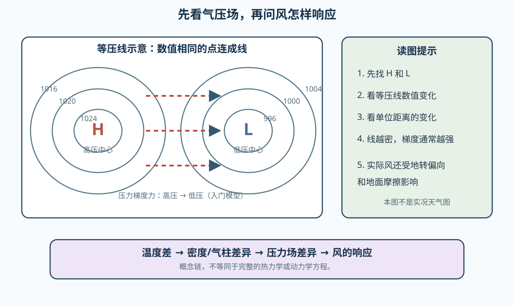

# 04 温度、气压与风的初步联系：先读懂气压场

> 看到“高压、低压和等压线”时，先不要急着背天气结论；先问气压在空间上怎样变化，以及空气会受到什么推动。

## 从上一课的记录继续

上一课我们记录了温度、气压和风。现在把两条记录放在一起：

```text
地点 A：气压 1020 hPa，风较弱
地点 B：气压 1004 hPa，风较强
```

这两条记录还不能单独证明“风是从 A 吹到 B”，但它提醒我们：不同地点之间的气压差，可能和空气运动有关。本课只建立这个联系，不进入完整的天气系统和风场计算。

## 学习目标

读完本单元后，你应该能够：

- 解释气压差、压力梯度和等压线的基本含义；
- 判断等压线疏密与压力梯度强弱的初步关系；
- 区分“压力梯度力的方向”和“实际风向”；
- 说明温度差为什么可能通过密度和气压背景影响风。

## 一、气压差为什么会推动空气

气压可以理解为单位面积上方空气产生的压力。若相邻两处气压不同，空气会受到一个试图减小这种差异的作用力，这就是入门阶段所说的**压力梯度力**。

在暂时忽略地球自转、摩擦和地形的简化模型中，压力梯度力指向从高压到低压。气压差越集中在短距离内，单位距离的变化越快，压力梯度通常越强，空气运动也更容易加速。

这不是一句可以直接替代真实风向的口诀。真实大气中还存在地球自转造成的地转偏向，以及近地面建筑、植被、山地和地表粗糙度造成的摩擦影响。[NOAA 对风的起源说明](https://prod-01-alb-www-noaa.woc.noaa.gov/jetstream/synoptic/origin-of-wind)和 [Met Office 对风流动的解释](https://weather.metoffice.gov.uk/learn-about/weather/how-weather-works/high-and-low-pressure/wind-flow)都把这一区分作为理解气压场的基础。

## 二、等压线是怎样读的

天气图上，把气压相同的地点连起来，就得到等压线。读一张简单气压图时，可以按这个顺序：

1. 找数值较高、向中心增加的区域，标为高压中心 H；
2. 找数值较低、向中心降低的区域，标为低压中心 L；
3. 比较相同距离内气压变化了多少；
4. 看等压线是否密集，作为压力梯度强弱的线索；
5. 再考虑风向约定、地转偏向和摩擦，而不是直接把箭头画成高压到低压。



### “线越密，风一定越大”够准确吗？

不够。等压线越密通常意味着单位距离内气压变化更快，压力梯度更强，因此常常对应更强的风。但实际风速还受到摩擦、地形、稳定度、观测高度和天气系统结构等影响。它是一个读图线索，不是脱离情境的绝对保证。

## 三、风向到底指向哪里

气象学中的风向通常表示**风从哪里来**：

- 北风：空气主要从北方吹来，运动方向大致指向南方；
- 东南风：空气主要从东南方吹来，运动方向大致指向西北方。

因此读风场时，要把“风向名称”和“空气运动方向”分开。近地面风一般不会笔直地从高压中心指向低压中心，而是受到地转偏向和摩擦影响，斜穿等压线并绕高低压系统流动。在北半球的入门判断中，低压附近常呈逆时针、向内的环流，高压附近常呈顺时针、向外的环流；这是简化概念，不能替代具体天气图分析。

## 四、温度差怎样参与其中

温度不是“风的另一个名字”，但它会影响空气密度和气柱的厚度。地表受热不均、海陆差异和冷暖空气交汇，都会让不同地点的空气状态不同，进而改变气压的空间分布。

本课只记住一个概念链：

```text
温度差 → 空气密度与气柱差异 → 气压场差异 → 压力梯度 → 风的响应
```

这条链帮助我们把上一课的温度记录和本课的气压、风联系起来，但它不是完整的热力学或动力学方程。后续学习稳定度、锋面和天气系统时，再逐步补上定量关系。

## 一个简化读图例子

假设两块区域的气压差都是 8 hPa：

- 区域甲：8 hPa 的变化发生在 400 km 内；
- 区域乙：8 hPa 的变化发生在 80 km 内。

在其他条件相近的前提下，区域乙的单位距离气压变化更快，压力梯度更强，出现较强风的可能性通常更高。但最后仍要检查地形、摩擦和实际风观测。

## 回忆练习

先不看答案，尝试回答：

1. 等压线表示什么？
2. 为什么同样的气压差，发生在更短距离内时通常意味着更强的压力梯度？
3. “北风”表示空气向北运动吗？
4. 为什么不能只用“风从高压吹向低压”解释真实近地面风？

参考答案见[配套练习：从气压场读风向](../../../exercises/01-气象学基础/01.03-从气压场读风向/)。

## 常见混淆

- **高压/低压是相对的空间分布**：不能只看一个站点数字就断言整个区域是高压或低压系统；
- **压力梯度力方向 ≠ 实际风向**：前者是简化模型中的受力方向，后者是多种因素共同作用的结果；
- **风向不是去向**：北风来自北方，不是吹向北方；
- **等压线密集 ≠ 自动得到精确风速**：还需要考虑单位、地形、摩擦和观测高度。

## 小结

气压差会产生压力梯度力，压力梯度力在简化模型中推动空气从高压趋向低压。天气图用等压线把气压场画出来，线越密通常表示气压变化越快、压力梯度越强。真实风向和风速还会受到地球自转、摩擦、地形等因素影响；温度差则可以通过改变空气密度和气柱结构参与气压场形成。

下一课将把气压场、风场和降水等要素放进更大的天气尺度中，开始认识天气系统的空间范围和变化时间。

## 继续阅读

- [NOAA JetStream：Origin of Wind](https://prod-01-alb-www-noaa.woc.noaa.gov/jetstream/synoptic/origin-of-wind)
- [NWS：Pressure Gradient Force](https://www.weather.gov/jkl/education)
- [Met Office：Wind Flow](https://weather.metoffice.gov.uk/learn-about/weather/how-weather-works/high-and-low-pressure/wind-flow)
