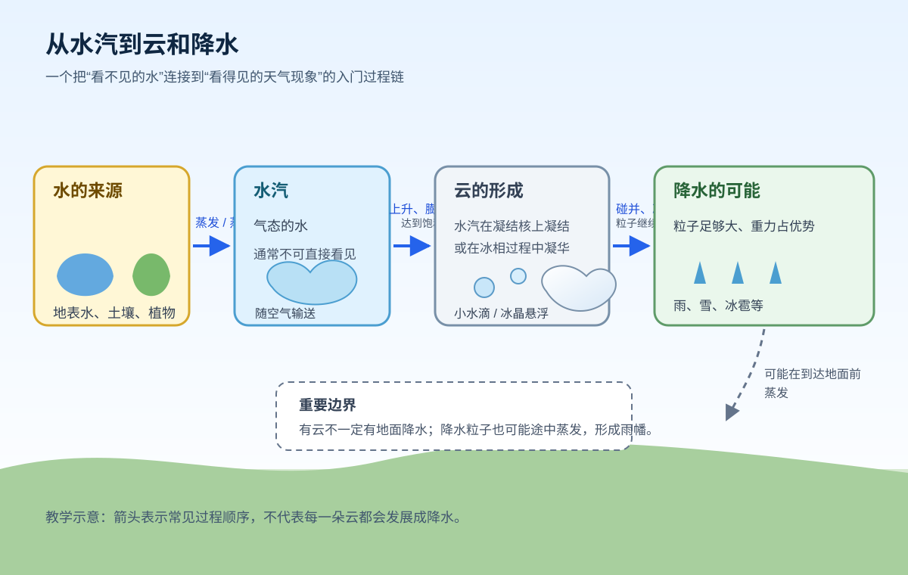

# 第五课：水汽、云与降水的入门图景

> 为什么“空气很潮湿”“天上有云”和“地面正在下雨”不是同一句话？

上一课我们把温度、气压和风放进了同一张关系图。这一课再向前一步：把空气中的水分，从看不见的水汽，一路连接到看得见的云和降水。

## 学完这一课，你应该能

- 区分水汽、云和降水分别是什么；
- 用“水汽来源 → 上升和冷却 → 饱和 → 凝结或凝华 → 粒子增长”的顺序讲述云和降水的入门过程；
- 看见“湿度高”“有云”或“有雨”时，知道哪些是观测事实，哪些只是待验证的解释；
- 解释为什么有云不一定下雨，以及为什么雨可能落不到地面。

## 1. 先把三个词分开

### 水汽：气态的水

水汽是气态的水，通常不能像云一样被肉眼直接看见。地表水、土壤和植物中的水，可以通过蒸发和蒸腾进入空气；水汽还会随着空气运动被输送到别处。

“空气里有水汽”并不等于“空气里已经有云”。水汽仍然以气体形式混在空气中，只有在温度和压力条件合适时，才可能转变成更容易看见的液态或固态粒子。

### 云：悬浮的微小粒子

[世界气象组织（WMO）国际云图集](https://cloudatlas.wmo.int/en/clouds.html)把云描述为悬浮在大气中的微小液态水粒子、冰粒子，或二者的集合，通常不接触地面。

因此，云不是“水汽本身变白了”，而是水汽经过相变后形成了许多微小粒子。它们足够小，可以在空气中悬浮一段时间。

### 降水：正在下落的粒子

当云滴、冰晶或它们进一步长大的粒子受到的重力作用足以让它们下落，并且下落过程没有完全消失，就可能形成雨、毛毛雨、雪、霰或冰雹等降水。WMO 的[降水与下落粒子说明](https://cloudatlas.wmo.int/hydrometeors-falling-particles.html)列出了这些常见类型。

一句话记忆：水汽是“气体状态的水”，云是“悬浮的微小粒子”，降水是“正在下落的粒子”。

## 2. 云通常怎样形成？

云的形成不是把水凭空变出来，而是让原本存在于空气中的水汽发生相变。入门时可以抓住四个环节：

1. **有水汽来源**：蒸发和蒸腾把水送入空气；
2. **空气上升并冷却**：空气上升时周围气压减小，空气膨胀，温度通常下降；
3. **达到饱和**：继续冷却后，空气能够容纳的水汽上限降低，空气接近或达到饱和；
4. **发生凝结或凝华**：水汽在凝结核上形成小水滴，或通过冰相过程形成冰晶，许多粒子聚在一起就能形成云。

这里的“达到饱和”是一个条件，不是降水的同义词。相对湿度接近 100% 说明空气接近饱和，但它本身不能保证一定出现云，更不能单独保证地面会下雨。是否形成可见云和降水，还与温度垂直分布、粒子大小、上升运动和云的结构有关。

## 3. 云为什么有时会下雨？

刚形成的云滴和冰晶通常很小，悬浮在空气中，并不会马上掉下来。它们需要通过碰并、冰相过程等方式继续增长，变得足够大，重力才更容易让它们下落。

[UCAR 的入门说明](https://scied.ucar.edu/kids/clouds-raindrops/making-raindrops)用一个容易想象的过程解释了雨滴形成：水汽先在凝结核上形成小水滴，小水滴继续增长，达到一定大小后才会落下。[NWS 的基础天气教育页面](https://www.weather.gov/jkl/education)也把蒸发、上升冷却、饱和、凝结和降水放在同一条基础过程链中。

但要注意两个边界：

- **有云不一定有降水**：云中的粒子可能一直太小，或者云层的上升和微物理过程不足以让粒子长大；
- **看到降水也不等于一定看见云底**：降水粒子下落时，如果进入较干的空气，可能在到达地面前蒸发。这种只在空中看见降水条带、地面却没有对应降水的现象，常称为雨幡（virga）。

## 4. 用一张图记住过程链

读图时不要把箭头理解成“每一次都必然走到最后”。更准确的读法是：在有水汽的前提下，空气上升和冷却可能促成云的形成；云中的粒子还要继续增长，才有形成降水的可能。

## 5. 一个生活化的观察例子

夏季午后，地面受热，近地面空气变暖。若空气中水汽较多，局地上升运动可能增强；空气上升、膨胀并冷却后，天空可能出现向上发展的积云。

这时我们可以把观察和解释分开写：

| 记录层次 | 可以怎么写 | 不能直接推出什么 |
| --- | --- | --- |
| 观察事实 | 14:00 出现分散积云，17:00 出现较厚云体并记录到阵雨 | 不能只凭云的外观断言降水一定持续 |
| 可能解释 | 水汽较多、上升冷却和粒子增长可能共同参与 | 不能仅凭一站观测确定完整因果链 |
| 进一步验证 | 查相对湿度/露点、雷达回波、降水量和附近站点变化 | 不把教学示意图当作真实天气图 |

这也是气象学习中的一个好习惯：先写“我看到了什么”，再写“我认为可能发生了什么”，最后说明还需要哪些资料。

## 6. 观察时分别记录什么？

做一次基础天气记录时，可以把水汽、云和降水拆成三列：

| 对象 | 入门记录 | 例子 |
| --- | --- | --- |
| 水汽状态 | 相对湿度、露点或体感描述 | 相对湿度 86%，露点较高 |
| 云 | 云量、云状和云底变化 | 分散积云逐渐增厚 |
| 降水 | 类型、是否到达地面、强度和持续时间 | 17:00—17:30 阵雨 4.2 mm |

记录时写清时间、地点、单位和资料来源。相对湿度是“接近饱和的程度”的比例表达，不是“空气中有百分之多少是水”。如果还不能判断云状或降水类型，可以写“待确认”，不要用猜测替代观测。

## 7. 合上页面，先回忆

1. 水汽、云和降水的状态或运动特征分别是什么？
2. 为什么空气上升时更容易形成云？请按“上升—冷却—饱和—相变”说一遍。
3. 为什么“相对湿度高”不能单独推出“马上下雨”？
4. 什么是雨幡？它说明了云和地面降水之间怎样的关系？

## 8. 三个常见混淆

- **把水汽当成云**：水汽是气态水，通常不可见；云主要由悬浮的小水滴和/或冰晶组成。
- **把云当成雨**：云是悬浮粒子，降水是正在下落的粒子；云中的粒子还需要长大，才可能产生降水。
- **把湿度百分数当成水量百分数**：相对湿度描述空气距离饱和有多近，不能直接当作空气中水的质量比例。

## 小结与下一步

本课的主线是：**水汽有来源，空气上升会冷却，冷却可能使空气达到饱和，水汽随后凝结或凝华形成云；云中粒子继续增长，才有形成降水的可能。**

下一课将把注意力从“一个过程如何发生”转向“同一场天气为什么在不同时间和地点表现不同”，开始认识时间尺度和空间尺度。

### 延伸入口

- [WMO International Cloud Atlas](https://cloudatlas.wmo.int/en/home.html)：云的分类、术语和气象现象的专业入口；
- [WMO Glossary](https://cloudatlas.wmo.int/en/glossary.html)：查阅凝结、凝结核、碰并和降水等术语；
- [NWS Basic Weather Education](https://www.weather.gov/jkl/education)：用入门语言回顾蒸发、冷却、云和降水的联系。
