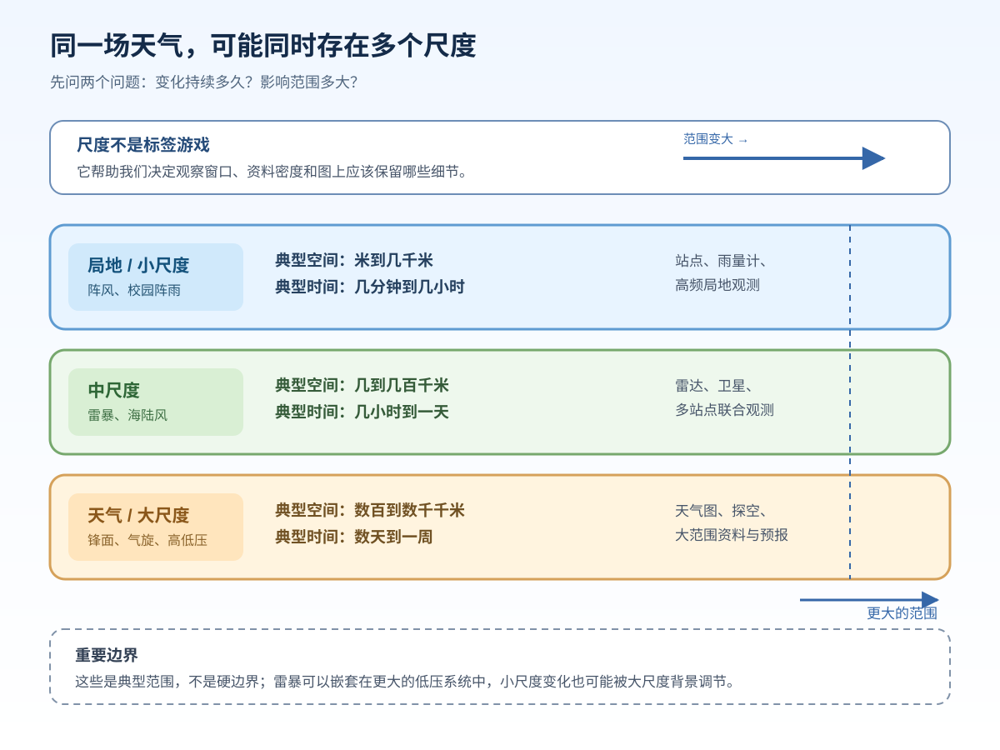

# 第六课：时间尺度与空间尺度

> 同一天下午，为什么校园里正在下雨，南京另一边却是晴天？

上一课我们学习了水汽、云和降水的过程。这一课换一个角度：不急着问“天气是什么”，先问“这个变化持续多久、影响多大”。这样才能决定应该看一条站点时间序列、一张雷达图，还是一张更大范围的天气图。

## 学完这一课，你应该能

- 区分时间尺度、空间尺度、时间分辨率和空间分辨率；
- 用“局地—中尺度—天气/大尺度”的粗略框架描述天气现象；
- 理解小尺度过程可以嵌套在大尺度天气系统中；
- 根据问题选择观测范围和资料类型，并说明一个站点观测的代表性边界。

## 1. 先用两把尺子描述变化

### 时间尺度：变化持续多久？

时间尺度关注一个现象从出现、发展到消散的大致时长。例如，一阵突发阵风可能只持续几分钟，海陆风可能随昼夜变化，锋面或气旋系统则可能影响一个地区数天。

时间尺度不是“预报提前多久”。“提前两天发布的预报”说的是预报提前量；“一个低压系统维持两天”说的是天气现象的时间尺度。两者可能有关，但不能混为一谈。

### 空间尺度：影响范围有多大？

空间尺度关注一个现象横向覆盖多大范围。校园围墙内的雨、覆盖南京市的雷暴过程、影响华东的大范围低压，关心的空间范围不同。

尺度判断不需要一开始就背固定数字。先用“米到几千米”“几到几百千米”“数百到数千千米”等量级建立直觉即可；不同教材、业务和研究问题的分界会有差异，而且真实现象往往跨越多个尺度。[UCAR 的大气运动教材](https://www.meted.ucar.edu/tropical/textbook_2nd_edition/navmenu.php?page=8.1.0&tab=2)也强调，大气运动同时发生在不同尺度上，较小的过程可以出现在较大的环流之中。

## 2. 三个入门层次

可以先用下面的方式建立“量级感”：

| 入门层次 | 典型现象 | 先问什么 |
| --- | --- | --- |
| 局地 / 小尺度 | 阵风、街区附近阵雨、湍流 | 这个点附近接下来几十分钟怎样变化？ |
| 中尺度 | 雷暴、海陆风、山谷风 | 这个天气单体或局地环流怎样移动和发展？ |
| 天气 / 大尺度 | 锋面、气旋、高低压系统 | 更大范围的天气形势怎样组织和演变？ |

这张表是思考工具，不是把自然界切成三层互不相干的盒子。一次雷暴既可以有很小的强降水核心，也可能受到更大范围低压、锋面或水汽输送的影响。

## 3. 资料也有自己的“观察窗口”

说一份资料“分辨率高”，至少要先问它在哪个方向高：

- **时间分辨率**：相邻两次记录或产品更新之间隔多久？间隔越短，越容易看见快速变化，但不自动意味着观测更准确；
- **空间分辨率**：相邻站点、网格或像元之间大致隔多远？间隔越小，通常越有机会描述细节，但仍受仪器、算法和观测误差限制；
- **观测范围**：资料覆盖一个点、一个区域，还是全球？覆盖范围大不代表每个局地细节都清楚；
- **代表性**：一个观测值能在多大程度上描述你关心的区域？它取决于仪器、观测间隔、周围地形和下垫面，以及你的应用目的。

[WMO 全球观测系统](https://public.wmo.int/activities/global-observing-system-gos/global-observing-system-gos)强调，观测网络需要根据用户需求考虑质量、空间分辨率、时间分辨率和长期稳定性。[WMO-No. 8 观测指南](https://community.wmo.int/site/knowledge-hub/programmes-and-initiatives/instruments-and-methods-observation-programme-imop/guide-instruments-and-methods-observation-wmo-no-8)还提醒，观测的代表性不是一个脱离场景的固定属性：同一个站点对城市总体、校园局地或农业地块的代表程度可能不同。

所以，“每 1 分钟记录一次”只说明时间采样很密；它并不能证明这个传感器看见了周围每个街区的变化。

## 4. 用问题倒推资料

面对一个天气问题，可以按三步走：

1. **先定时间窗口**：我关心未来 30 分钟、今天下午，还是未来几天？
2. **再定空间范围**：我关心一个校园、南京市，还是华东地区？
3. **最后选资料**：选择能覆盖这个窗口、并且细节足够支持问题的观测或产品。

| 问题 | 主要尺度 | 可先看的资料 | 还要小心什么 |
| --- | --- | --- | --- |
| 校园未来 30 分钟会不会有阵雨？ | 局地、快速变化 | 附近自动站/雨量计、雷达回波和临近时次观测 | 单个站点可能不代表整个校园，雷达回波也不等于地面雨量 |
| 南京东部的雷暴单体怎样移动？ | 中尺度、小时级 | 多站点观测、雷达连续图像、卫星云图 | 要对齐时间，区分云体、回波和地面降水 |
| 华东低压未来两天如何演变？ | 天气尺度、较大范围 | 地面天气图、探空、大范围卫星资料和预报场 | 大尺度资料可能看不清局地阵雨核心 |

资料选择不是“越复杂越好”，而是“与问题的尺度匹配”。如果问题只问校园半小时内的雨，先查一张覆盖全球的月平均气候图，通常就不是合适的第一步。

## 5. 一个天气现象的多尺度视角

假设 17:00 左右南京某地出现雷雨，可以同时写出三层描述：

- **局地层**：某个雨量计在 10 分钟内记录到降水增强；
- **中尺度层**：雷暴单体在雷达图上向东移动，并在多个站点留下降水记录；
- **天气层**：更大范围的低压、锋面或水汽输送为局地对流提供了背景条件。

这三句话不互相排斥。第一句回答“这个点此刻怎样”，第二句回答“天气单体怎样发展”，第三句回答“更大的形势可能怎样影响它”。如果把它们混成一个尺度，就容易出现“天气图没有画出校园雨，所以校园不可能下雨”的错误判断。

## 6. 做一条不容易误读的记录

在已有的“时间—地点—要素—单位—资料来源”基础上，再加两项：**时间窗口**和**空间范围**。

| 时间 | 地点/范围 | 要素 | 资料来源 | 窗口与尺度备注 |
| --- | --- | --- | --- | --- |
| 17:00—17:30 | 校园北侧雨量计 | 降水量 4.2 mm | 自动站 | 点状、半小时累计；不代表全市 |
| 17:00—18:00 | 南京东部 | 雷达回波与多站点降水 | 雷达/站点 | 区域、小时级；需对齐时间 |

写清这些信息后，读者才知道你是在描述一个点、一个区域，还是在讨论更大的天气背景。

## 7. 合上页面，先回忆

1. “一个现象持续两小时”和“每五分钟记录一次”分别描述什么？
2. 为什么高时间分辨率不等于高空间分辨率？请举一个站点观测的例子。
3. 一场雷暴为什么可以同时属于局地、中尺度和更大天气背景的讨论对象？
4. 如果问题是“校园未来 30 分钟是否会下雨”，你会先查哪些资料？为什么？

## 8. 三个常见混淆

- **把时间尺度当成预报提前量**：一个天气系统可以持续数天，预报也可以提前数小时或数天发布，这是两个不同问题。
- **把分辨率当成准确率**：资料点更密、更新更快，可能看见更多细节，但不自动消除仪器误差、代表性问题或算法限制。
- **把一个点当成整个区域**：站点记录首先是这个站点附近的观测；要推广到城市或区域，需要考虑站点环境、空间差异和多点资料。

## 小结与下一步

本课的主线是：**先确定现象的时间尺度和空间尺度，再选择匹配的观测窗口和资料分辨率；同时记住小尺度过程可以嵌套在大尺度天气系统中，单个观测也有代表性边界。**

下一课将把这个框架用于具体资料判读：面对站点图或时间序列，先看什么、后看什么，如何避免“看见一个数就立刻下结论”。

### 延伸入口

- [UCAR：Spatial and Temporal Scales in the Tropics](https://www.meted.ucar.edu/tropical/textbook_2nd_edition/navmenu.php?page=8.1.0&tab=2)：查看不同大气运动尺度的关系；
- [WMO：Global Observing System](https://public.wmo.int/activities/global-observing-system-gos/global-observing-system-gos)：理解观测网络与时空分辨率需求；
- [WMO-No. 8：Guide to Instruments and Methods of Observation](https://community.wmo.int/site/knowledge-hub/programmes-and-initiatives/instruments-and-methods-observation-programme-imop/guide-instruments-and-methods-observation-wmo-no-8)：延伸阅读观测代表性、采样和仪器方法。
